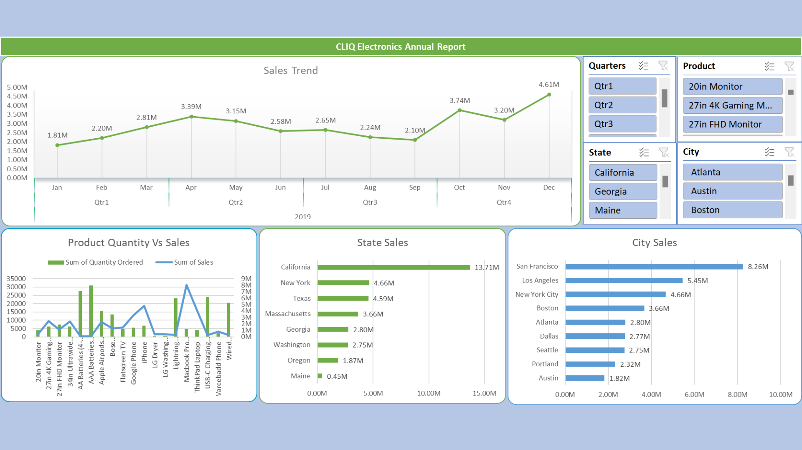

# 📊 Annual Sales Analysis – Cliq Electronics (Excel Project)

## 🔹 Project Overview
Analyzed raw sales data of **Cliq Electronics (2019)** to identify top-performing products, regions, and seasonal trends.  
Designed an **interactive Excel dashboard** using pivot tables, slicers, and charts to enable data-driven business decisions.

## 🔹 Business Problem
Cliq Electronics wanted to:
- Identify **top-selling products** and their contribution to revenue.
- Analyze **state-wise performance** across the US.
- Detect **seasonality trends** and revenue dips.
- Support **inventory planning** and **marketing strategies**.

## 🔹 Tools & Skills Used
- **Excel**: Pivot Tables, Charts, Dashboards, EDA
- **Data Cleaning** & Structuring
- **Business Strategy & Recommendations**

## 🔹 Key Insights
- 📍 **California** contributed **~40% of sales**, the highest among all states.  
- 💻 **Macbook Pro Laptop** alone drove **23% of revenue**, highlighting product concentration.  
- 📈 **December sales peaked at $4.61M (+35% vs avg.)**, confirming strong year-end demand.  
- 📉 Sales consistently declined from **April–September**, indicating seasonal underperformance.

## 🔹 Recommendations
- Scale **Q4 inventory** and campaigns to capture seasonal surge.  
- Introduce **mid-year promotions (Apr–Sept)** to stabilize weak sales.  
- Focus on **Macbook Pro marketing in California** while expanding into underperforming states.  

## 🔹 Project Files
- `data/raw_sales_data.xlsx` → Original dataset  
- `analysis/Annual-Sales-Analysis-Cliq-Electronics.xlsx` → Interactive dashboard with slicers & charts  
- `docs/Cliq_Electronics_Annual_Sales_Report.pdf` → Clean PDF version for quick review  
- `images/dashboard_preview.png` → Dashboard preview  

## 🔹 Dashboard Preview

---

📌 **Result**: The project translated raw sales data into **actionable business strategies** for growth, demonstrating expertise in **data visualization, sales analytics, and Excel dashboarding**.  
